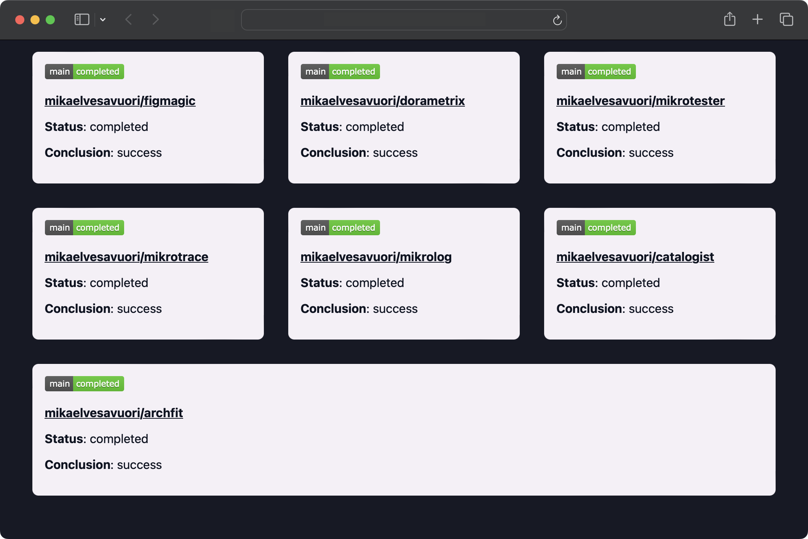

# GitHub Dashboards

## Visualize your GitHub repositories and their workflow statuses 📈 like no thing at all 😎

This is a ready-to-use solution with a serverless backend (AWS: API Gateway, Lambda, DynamoDB) and a simple frontend to render the dashboards.

Works with both private and public repositories.



## Solution

Calls are made from the front-end to the back-end without any authorization. It's suggested you lock down the front-end with some applicable means, like an SSO layer or Cloudflare Access or something similar.

_If you want to get data for private repositories you will need a "classic" GitHub personal access token (PAT) with permissions to use the `workflow` scope. If you are in an organization, make sure to authorize the use of the token against your organization._

From the Lambda function, it will first check a hash of the input in DynamoDB as a type of cache. If the cache has content and it's fresher than a minute, return it. Else go to GitHub to retrieve workflow data, transform it a bit, pass it to Shields.io to generate the SVG badge, and then finally return all of it.

_If you're curious, each dashboard component is ~1200 bytes so that should give you an idea for the DynamoDB usage._

**Feel free to upgrade it with nicer visuals, API keys or security, client-side caching, or anything else you fancy!**

## Prerequisites

- Recent [Node.js](https://nodejs.org/en/) (ideally 20+) installed.
- Amazon Web Services (AWS) account with sufficient permissions so that you can deploy infrastructure.
- Ideally some experience with [Serverless Framework](https://www.serverless.com) as that's what we will use to deploy the service and infrastructure.
- You will need to deploy the stack prior to working with it locally as it uses actual infrastructure even in local mode.

## Installation

Clone, fork, or download the repo as you normally would. Run `npm install`.

## Deployment

Run `npm run deploy` once you are authenticated with AWS. You will get a URL for your endpoint - use this in the front-end code.

For the front-end, just host it on a static website host like Cloudflare Pages or Netlify.

## Commands

The below commands are the most critical ones. See `package.json` for more commands! Substitute `npm` for `yarn` or whatever floats your boat.

- `npm start`: Run Serverless Framework in offline mode
- `npm test`: Run tests on the codebase
- `npm run deploy`: Deploy with Serverless Framework
- `npm run build`: Package and build the code with Serverless Framework
- `npm run teardown`: Removes the deployed stack

## Configuration

### Required

You have to set the following in `serverless.yml`:

- `custom.config.awsAccountNumber`: Your AWS account number.
- `GITHUB_TOKEN` must be set if you want to call private repositories.

_Optionally you can use AWS Secrets Manager instead of hard-coding the GitHub token. There is some code prepped for this, but you will have to manually create the secret in your AWS account._

In `frontend/index.html`, you will have to modify:

- The endpoint for the `getData()` function, as well as the ingoing payload.

## Example API call

### Get dashboard data

#### Request

`POST {{BASE_URL}}/`

```json
[
  {
    "owner": "mikaelvesavuori",
    "repo": "dorametrix",
    "ref": "main"
  },
  ...
]
```

#### Successful response

Example below. One object per successful request.

```json
[
  {
    "conclusion": "success",
    "status": "completed",
    "owner": "mikaelvesavuori",
    "repo": "dorametrix",
    "ref": "main",
    "badge": "<svg xmlns=\"http://www.w3.org/2000/svg\" xmlns:xlink=\"http://www.w3.org/1999/xlink\" width=\"104\" height=\"20\" role=\"img\" aria-label=\"main: completed\"><title>main: completed</title><linearGradient id=\"s\" x2=\"0\" y2=\"100%\"><stop offset=\"0\" stop-color=\"#bbb\" stop-opacity=\".1\"/><stop offset=\"1\" stop-opacity=\".1\"/></linearGradient><clipPath id=\"r\"><rect width=\"104\" height=\"20\" rx=\"3\" fill=\"#fff\"/></clipPath><g clip-path=\"url(#r)\"><rect width=\"37\" height=\"20\" fill=\"#555\"/><rect x=\"37\" width=\"67\" height=\"20\" fill=\"#4c1\"/><rect width=\"104\" height=\"20\" fill=\"url(#s)\"/></g><g fill=\"#fff\" text-anchor=\"middle\" font-family=\"Verdana,Geneva,DejaVu Sans,sans-serif\" text-rendering=\"geometricPrecision\" font-size=\"110\"><text aria-hidden=\"true\" x=\"195\" y=\"150\" fill=\"#010101\" fill-opacity=\".3\" transform=\"scale(.1)\" textLength=\"270\">main</text><text x=\"195\" y=\"140\" transform=\"scale(.1)\" fill=\"#fff\" textLength=\"270\">main</text><text aria-hidden=\"true\" x=\"695\" y=\"150\" fill=\"#010101\" fill-opacity=\".3\" transform=\"scale(.1)\" textLength=\"570\">completed</text><text x=\"695\" y=\"140\" transform=\"scale(.1)\" fill=\"#fff\" textLength=\"570\">completed</text></g></svg>"
  },
  ...
]
```

## References

- [GitHub: Workflow Runs](https://docs.github.com/en/rest/actions/workflow-runs?apiVersion=2022-11-28)
- [GitHub: Creating tokens](https://docs.github.com/en/authentication/keeping-your-account-and-data-secure/managing-your-personal-access-tokens)
- [Shields.io badges](https://shields.io/badges)
